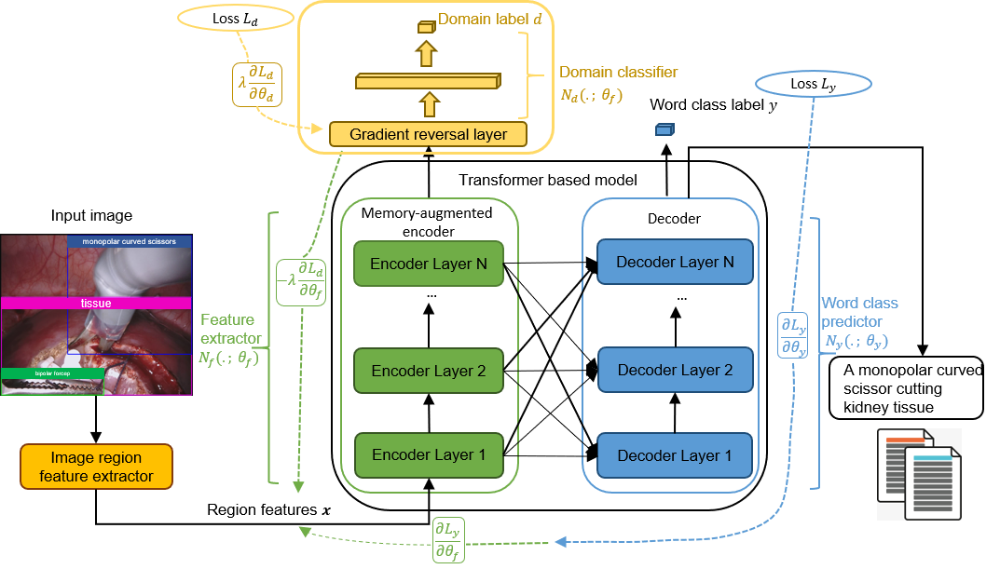
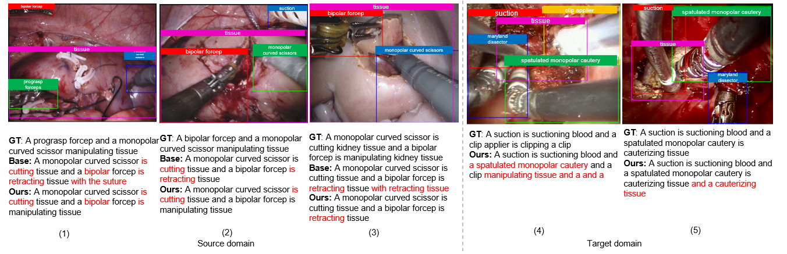

# ReportDALS
This repository contains the reference code for the paper "Learning Domain Adaptation with Model Calibration for Surgical Report Generation in Robotic Surgery"

<p align="center">
  
</p>

## Environment setup
Clone the repository and create the `m2release` conda environment using the `environment.yml` file:
```
conda env create -f environment.yml
conda activate m2release
```

Then download spacy data by executing the following command:
```
python -m spacy download en
```

Note: Python 3.6 is required to run our code. 


## Preprocessing (Optional Step)
The codes in preprocessing folder are used to prepare the annotations files which store features path of each surgical image and corresponding caption. This step is optional, you can skip it and directly download the annotation folder according to the next step.

We split the train / val dataset for In-domain dataset (MICCAI EndoVisSub2018-RoboticSceneSegmentation)(https://endovissub2018-roboticscenesegmentation.grand-challenge.org/Data/) in CaptionCollection.py, and for Out-of-domain dataset (SGH+NUH Transoral robotic surgery) in DACaptionCollection.py. You need to modify the dir_root_gt properly, switch between the two different seq_set and change the output file name correspondingly to get train dataset files and val dataset files. 

For each surgical image, we create a .xml file which stores the caption and coordinates of bounding boxes. You can find xml folders from https://drive.google.com/file/d/1b9OGl8aqyzeOua6kCjCln9yvPZ3OSX8f/view?usp=sharing  CaptionCollection.py and DACaptionCollection.py read these .xml files and collect all captions and corresponding feature path into .json file.


Run `python Preprocessing/CaptionCollection.py` to get the train / val annotations files for in-domain.

Run `python Preprocessing/DACaptionCollection.py` to get the train / val annotations files for out-of-domain.

## Data preparation
To run the code, annotations folder and features folder for the dataset are needed. Please download the annotations folder from https://drive.google.com/drive/folders/1cR5Wt_mKqn4qF45-hTnKzhG97pQL7ttU?usp=sharing and download the features folder from https://drive.google.com/file/d/1b9OGl8aqyzeOua6kCjCln9yvPZ3OSX8f/view?usp=sharing


## Evaluation
1) To reproduce the results of our model reported in our paper, download the pretrained model file [saved_best_checkpoints/7_saved_models_final_3outputs/m2_transformer_best.pth](https://drive.google.com/drive/folders/12Gckx3fDW5ekFxHKpWPnSvNz4hvFafN2?usp=sharing) 

Run `python val_ours.py --exp_name m2_transformer --batch_size 50 --m 40 --head 8 --warmup 10000 --features_path /path/to/features/instruments18_caption/ --annotation_folder annotations/annotations_resnet --features_path_DA /path/to/features/instruments18_caption/DomainAdaptation/ --annotation_folder_DA annotations/annotations_DA` 

You will get the validation results on In-domain (MICCAI) dataset and UDA (unsupervised domain adapatation) results on Out-of-domain (SGH NUH) dataset. 

2) To reproduce the results of the base model (M² Transformer), download the pretrained model file [saved_best_checkpoints/MICCAI_SGH_Without_LS/ResNet/m2_transformer_best.pth](https://drive.google.com/drive/folders/12Gckx3fDW5ekFxHKpWPnSvNz4hvFafN2?usp=sharing)


Run `python val_base.py --exp_name m2_transformer --batch_size 50 --m 40 --head 8 --warmup 10000 --features_path /path/to/features/instruments18_caption/ --annotation_folder annotations/annotations_resnet`

3) To reproduce the Zero-shot, One-shot, Few-shot results on Out-of-domain with our model, download the pretrained our model files
[saved_best_checkpoints/3_DA_saved_models/zero_shot/Base_GRL_LS/m2_transformer_best.pth]
[saved_best_checkpoints/3_DA_saved_models/one_shot/Base_GRL_LS/m2_transformer_best.pth]
[saved_best_checkpoints/3_DA_saved_models/few_shot/Base_GRL_LS/m2_transformer_best.pth]

from https://drive.google.com/drive/folders/12Gckx3fDW5ekFxHKpWPnSvNz4hvFafN2?usp=sharing

Then change the load path of the pretrained model to the above path accordingly in val_base.py.

Run `python val_zero_shot.py --exp_name m2_transformer --batch_size 1 --m 40 --head 8 --warmup 10000 --features_path /path/to/features/instruments18_caption/DomainAdaptation/ --annotation_folder annotations/annotations_DA_zero_shot`

Run `python val_base.py --exp_name m2_transformer --batch_size 5 --m 40 --head 8 --warmup 10000 --features_path /path/to/features/instruments18_caption/DomainAdaptation/ --annotation_folder annotations/annotations_DA_one_shot`

Run `python val_base.py --exp_name m2_transformer --batch_size 5 --m 40 --head 8 --warmup 10000 --features_path /path/to/features/instruments18_caption/DomainAdaptation/ --annotation_folder annotations/annotations_DA_few_shot`

4) To reproduce the Zero-shot, One-shot, Few-shot results on Out-of-domain with base model, download the pretrained base model files
[saved_best_checkpoints/3_DA_saved_models/zero_shot/Base/m2_transformer_best.pth]
[saved_best_checkpoints/3_DA_saved_models/one_shot/Base/m2_transformer_best.pth]
[saved_best_checkpoints/3_DA_saved_models/few_shot/Base/m2_transformer_best.pth]

from https://drive.google.com/drive/folders/12Gckx3fDW5ekFxHKpWPnSvNz4hvFafN2?usp=sharing

Then do change the load path in in val_base.py and run the same commands just like 3)


You can also use the following arguments:

| Argument | Possible values |
|------|------|
| `--batch_size` | Batch size (default: 10) |
| `--workers` | Number of workers (default: 0) |
| `--features_path` | Path to detection features |
| `--annotation_folder` | Path to folder with annotations |


## Training procedure
1) Run `python train_ours.py --exp_name m2_transformer --batch_size 50 --m 40 --head 8 --warmup 10000 --features_path /path/to/features/instruments18_caption/ --annotation_folder annotations/annotations_resnet --features_path_DA /path/to/features/instruments18_caption/DomainAdaptation/ --annotation_folder_DA annotations/annotations_DA` to reproduce the results from our model.


2) Run `python train_base.py --exp_name m2_transformer --batch_size 50 --m 40 --head 8 --warmup 10000 --features_path /path/to/features/instruments18_caption/ --annotation_folder annotations/annotations_resnet` to reproduce the results from the base model (M² Transformer).

3) Fine-tune the pretrained our model [saved_best_checkpoints/4_save_models_oldfeatures_baseGRLLS/m2_transformer_best.pth](https://drive.google.com/drive/folders/12Gckx3fDW5ekFxHKpWPnSvNz4hvFafN2?usp=sharing) on Out-of-domain in Zero-shot, One-shot, Few-shot manners,

Please change the load path of the pretrained model to 'saved_best_checkpoints/4_save_models_oldfeatures_baseGRLLS/m2_transformer_best.pth' in each DA_xxx_shot.py firstly

Run ` python DA_zero_shot.py --exp_name m2_transformer --batch_size 1 --m 40 --head 8 --warmup 10000 --features_path /path/to/features/instruments18_caption/DomainAdaptation/ --annotation_folder annotations/annotations_DA_zero_shot` 

Run ` python DA_one_shot.py --exp_name m2_transformer --batch_size 5 --m 40 --head 8 --warmup 10000 --features_path /path/to/features/instruments18_caption/DomainAdaptation/ --annotation_folder annotations/annotations_DA_one_shot` 

Run ` python DA_few_shot.py --exp_name m2_transformer --batch_size 5 --m 40 --head 8 --warmup 10000 --features_path /path/to/features/instruments18_caption/DomainAdaptation/ --annotation_folder annotations/annotations_DA_few_shot` 
 to reproduce the results from our model. 

4) Fine-tune the pretrained base model [saved_best_checkpoints/MICCAI_SGH_Without_LS/ResNet/m2_transformer_best.pth](https://drive.google.com/drive/folders/12Gckx3fDW5ekFxHKpWPnSvNz4hvFafN2?usp=sharing) on Out-of-domain in Zero-shot, One-shot, Few-shot manners, please change the load path of the pretrained model to 'saved_best_checkpoints/MICCAI_SGH_Without_LS/ResNet/m2_transformer_best.pth' in each DA_xxx_shot.py firstly and run the same commands as 3) to reproduce the results from base model.


You can also use the following arguments:

| Argument | Possible values |
|------|------|
| `--exp_name` | Experiment name|
| `--batch_size` | Batch size (default: 10) |
| `--workers` | Number of workers (default: 0) |
| `--m` | Number of memory vectors (default: 40) |
| `--head` | Number of heads (default: 8) |
| `--warmup` | Warmup value for learning rate scheduling (default: 10000) |
| `--resume_last` | If used, the training will be resumed from the last checkpoint. |
| `--resume_best` | If used, the training will be resumed from the best checkpoint. |
| `--features_path` | Path to detection features |
| `--annotation_folder` | Path to folder with annotations |
| `--logs_folder` | Path folder for tensorboard logs (default: "tensorboard_logs")|

(In our case, /path/to/features/ is /media/mmlab/data_2/mengya/)


<p align="center">
  
</p>


